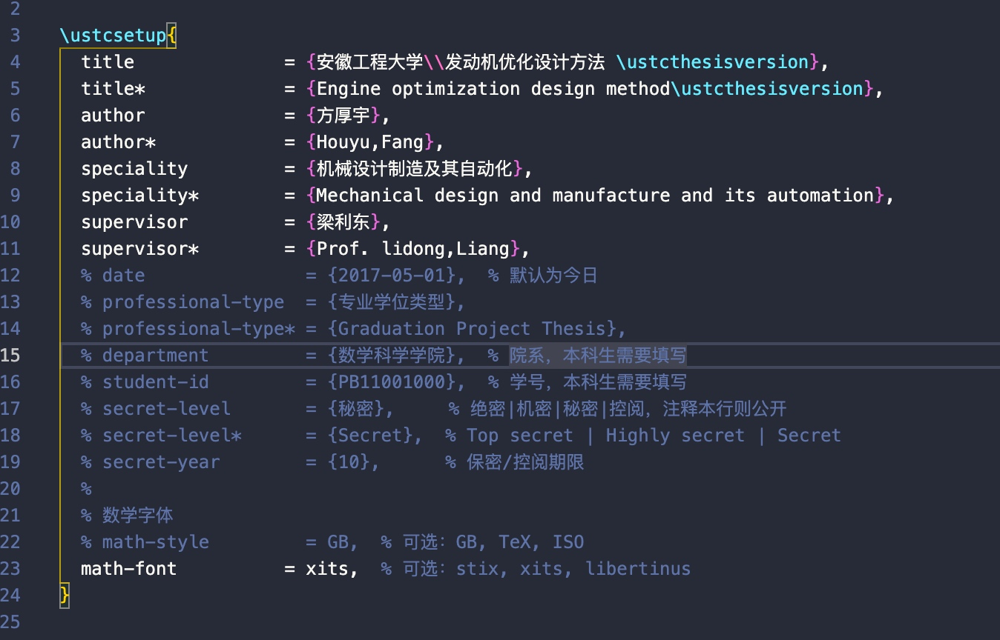

# latex

使用中科大的论文模板进行论文编写

[源码](https://github.com/ustctug/ustcthesis)


## 添加章节方法
ustc论文模板:
将每章节进行了文件划分,在`main.tex`中定义:


1. 在`main.tex`中添加如下代码,`intro.tex`是章节文件名
```latex
\input{chapters/intro.tex}
```
2. 在`chapters`目录下添加`intro.tex`文件

3. 在`intro.tex`文件中写章节内容

## 修改封面
### 一般信息
一般信息只需要在文件`ustcsetup.tex`中更改文字内容即可.


> 注意: title* 和 author* 是用于英文封面的
### 封面学校名等
1. 首先将学校的图片放入`figures`文件夹中

> 居然支持pdf格式的 头回见

2. 然后在`ustcthesis.cls`文件中找到中文封面注释


3. 修改校徽,找到这行代码,然后更改校徽的文件路径即可(把文件名换掉即可)
    

4. 修改学校名(这玩意不是文字,是图片或者pdf)
    


## 编译命令
```shell
latexmk -xelatex main.tex
```

## 标题写法

```latex

\chapter{绪论}

\section{一级节标题}

\subsection{二级节标题}

\subsubsection{三级节标题}

\paragraph{四级节标题}

\subparagraph{五级节标题}

```

## 脚注
```latex
\section{脚注}

Lorem ipsum dolor sit amet, consectetur adipiscing elit, sed do eiusmod tempor
incididunt ut labore et dolore magna aliqua.
\footnote{Ut enim ad minim veniam, quis nostrud exercitation ullamco laboris
  nisi ut aliquip ex ea commodo consequat.
  Duis aute irure dolor in reprehenderit in voluptate velit esse cillum dolore
  eu fugiat nulla pariatur.}

```

## 图片
```latex
\begin{figure}[h]
  \centering
  \includegraphics[width=0.3\textwidth]{ustc-badge.pdf}
  \caption{图号、图题置于图的下方}
  \label{fig:badge}
  \note{注：图注的内容不宜放到图题中。}
\end{figure}
```

