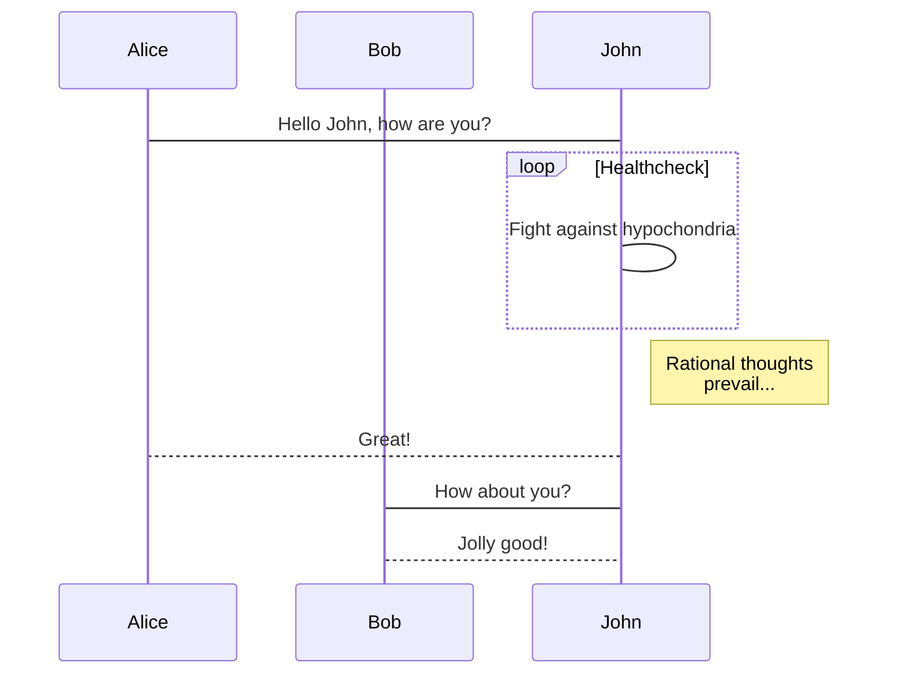

# mweb

快捷键


## GFM syntax guide

### Newlines

End a line with two or more spaces + enter.
Just typing enter to newline,please go to Settings and enable "Translate newlines to `<br>` tags" ( default is enable ).

### Task lists

**Example:**

```
- [ ] task one not finish `- + SPACE + [ ]`
- [x] task two finished `- + SPACE + [x]`
```

**Result:**

- [ ] task one not finish `- + SPACE + [ ]`
- [x] task two finished `- + SPACE + [x]`


### LaTeX

Markdown syntax:

    Block-level formula:
    ```math
    x = \dfrac{-b \pm \sqrt{b^2-4ac}}{2a}
    ```
    
    In-line formula: ``\Gamma(n) = (n-1)!\quad\forall n\in\mathbb N``


The resut is (enable LaTeX in the settings page):

Block-level formula:

```math
x = \dfrac{-b \pm \sqrt{b^2-4ac}}{2a}
```

In-line formula: ``\Gamma(n) = (n-1)!\quad\forall n\in\mathbb N``

Note: For compatibility with MWeb 3, $\Gamma(n) = (n-1)!\quad\forall n\in\mathbb N$ is also supported
And block-level syntax
$$ x = \dfrac{-b \pm \sqrt{b^2-4ac}}{2a} $$
But it is recommended to use the new syntax.

## MWeb drawing

### mermaid

mermaid is a popular drawing gallery. It supports flowcharts, sequence diagrams and Gantt charts. Its official website is: <https://mermaidjs.github.io/>. The syntax of mermaid in MWeb is to declare code blocks. The language is mermaid, and the mermaid drawing grammar can be written in the code block. You can copy the following grammar to MWeb to view the result.

    ```mermaid
    sequenceDiagram
        participant Alice
        participant Bob
        Alice->John: Hello John, how are you?
        loop Healthcheck
            John->John: Fight against hypochondria
        end
        Note right of John: Rational thoughts <br/>prevail...
        John-->Alice: Great!
        John->Bob: How about you?
        Bob-->John: Jolly good!
    ```
 
**The result is:**
 

### echarts

echarts is a js drawing gallery produced by Baidu. Its website is: <https://echarts.apache.org/zh/index.html>. It has very powerful functions. MWeb supports some basic usages of echarts, but not too advanced. . You can copy the following syntax to MWeb to try. You can also go to <https://echarts.apache.org/examples/zh/index.html> to view some examples. Note that MWeb can only parse the simple `option = {}`, but it should It is enough to use.

    ```echarts
    option = {
        xAxis: {
            type:'category',
            data: ['Mon','Tue','Wed','Thu','Fri','Sat','Sun']
        },
        yAxis: {
            type:'value'
        },
        series: [{
            data: [820, 932, 901, 934, 1290, 1330, 1320],
            type:'line'
        }]
    };
    ```

**The result is:**

```echarts
option = {
    xAxis: {
        type:'category',
        data: ['Mon','Tue','Wed','Thu','Fri','Sat','Sun']
    },
    yAxis: {
        type:'value'
    },
    series: [{
        data: [820, 932, 901, 934, 1290, 1330, 1320],
        type:'line'
    }]
};
```

### Footnote

**Example:**

```
This is a footnote:[^1]
```

**Result:**

This is a footnote:[^1]

[^1]: footnote text detail...


