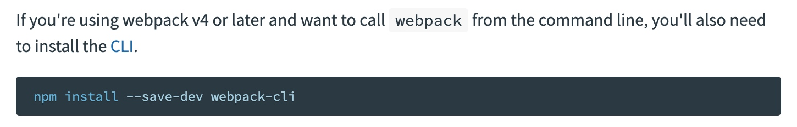
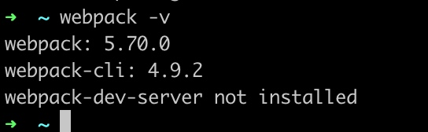
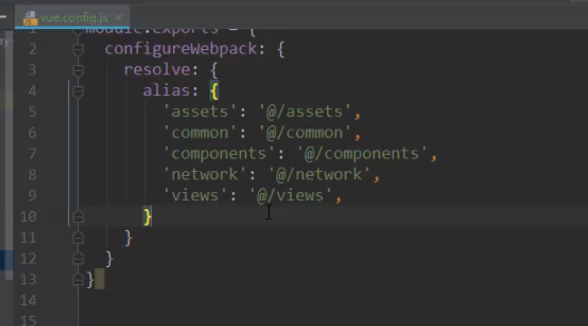

# webpack

模块打包工具

可以处理模块之间的依赖关系

webpack读取loader 是从右向左读取的

## 安装
wepack是依赖node的环境的

全局安装 可以使用webpack@version安装指定版本
```shell
sudo npm install webpack -g
```

看到官网,现在还要安装webpack-cli这个工具


`--save-dev` 是开发时依赖,项目打包后不需要继续使用了:用完就丢

```shell
sudo npm install webpack-cli -g
```


查看版本



## 配置路径别名




## 编辑器配置


