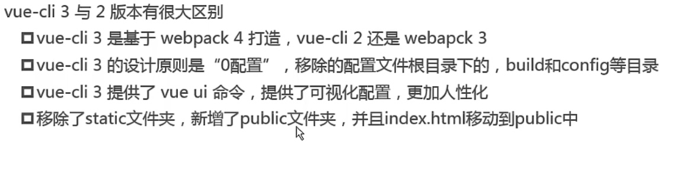
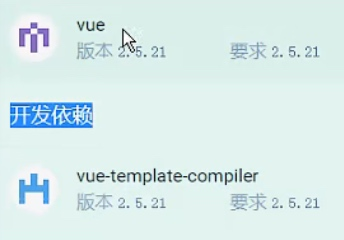
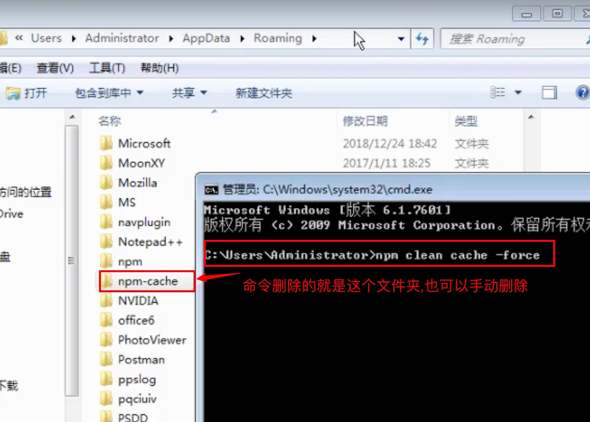
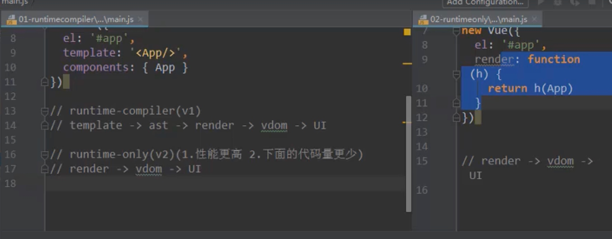

# vue-cli


[官网](https://cli.vuejs.org/zh/guide/creating-a-project.html)

## 安装和创建项目
使用前提: node

使用高版本(>=3)的创建:
```shell
vue create project-name
```


## vue-cli 3 



可以保存自定义的配置,下次可以直接选择该配置

删除操作:
....

public 文件夹会原封不动的保存到dist文件夹

通过GUI来创建项目
```shell
vue ui
```

这两个版本必须是一致的:


自定义配置:
`vue.config.js` vue-cli build的时候会将这个配置和默认的配置进行合并

---

课堂笔记
## vue-cli2 版本的目录结构

static目录会在后期打包的时候,原封不动的弄到dist文件夹中

babel是将es6语法转成es5的
babelrc 文件是用来配置babel的
.editconfig 文件是用来配置项目的代码约束的

## 版本的一些说明
^：表示版本号中最后的版本号（第3个）可能会变，大于等于的意思。
> 如：^1.1.2 ，表示>=1.1.2 <2.0.0，可以是1.1.2，1.1.3，.....，1.1.n,1.2.n，.....，1.n.n
> 如：^0.2.3 ，表示>=0.2.3 <0.3.0，可以是0.2.3，0.2.4，.....，0.2.n

~: 表示版本号中最后的两个版本号（第2个和第3个）安装的可能会变
> 如：~1.1.2，表示>=1.1.2 <1.2.0，可以是1.1.2，1.1.3，1.1.4，.....，1.1.n 
> 如：~1.1，表示>=1.1.0 <1.2.0，可以是同上

## 安装不了可能存在的问题与解决

如果在电脑上安装不了vue-cli,可能是因为没有用管理员运行cmd,也可能是因为没有删除这个文件夹.cmd如果没有用管理员打开可能删不掉这个文件夹



## 关掉ESlint
config文件夹下的index.js 中useEs巴拉巴拉的 改成false


## runtime-only 和 runtime-complier的区别:
main.js中是不同的
[博客讲解](https://blog.csdn.net/gqk01/article/details/118975822)


 
 render函数 
 createElement函数
 > 结论: 使用runtime-only

## 拉取 2.x 模板 (旧版本)
Vue CLI >= 3 和旧版使用了相同的 vue 命令，所以 Vue CLI 2 (vue-cli) 被覆盖了。如果你仍然需要使用旧版本的 vue init 功能，你可以全局安装一个桥接工具：

```shell
npm install -g @vue/cli-init
# `vue init` 的运行效果将会跟 `vue-cli@2.x` 相同
vue init webpack my-project
```


## e2e 
e2e: end to end 端到端的测试 借助selenium


