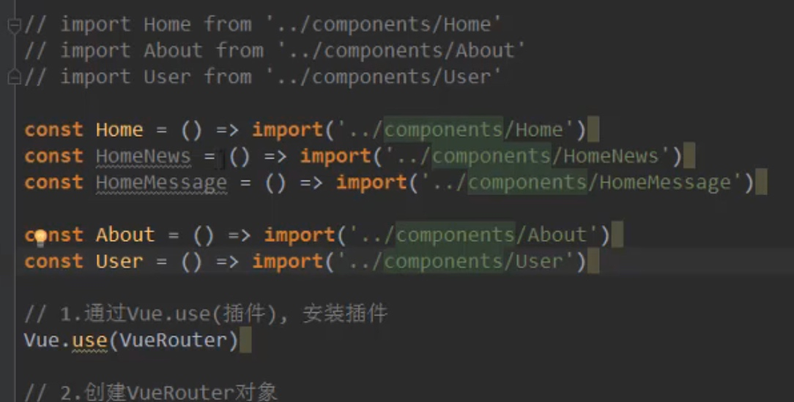

# vue-router

## 什么是路由


### 前端路由和后端路由

后端处理URL和页面之间的映射关系


### 前端渲染和后端渲染
后端渲染完页面然后丢给客户端


SPA: 单页面富应用 <= 目前前端处的阶段

## 原生方式改路由

### location的方式
通过hash来更改路由且保证页面不刷新
```js
location.hash = 'aaa'
```

### history的方式
类似于栈结构:push相当于入栈,back相当于出栈
```js
// 参数1: 对象
// 参数2: title
// 参数3: 路由
history.pushState({},'','home');

// 返回
history.back();
// 等同于
history.go(-1);// 弹出一个


// 
history.forward();

history.go(1);
```

不能返回:
```js
history.replaceState({},'','about');
```


## 安装vue-router

```shell
npm install vue-router --save
```

使用:


避免url上有#:


router-link标签:
最终渲染出来是a标签
to属性 : 跳转到指定url
tag属性: 指定router-link渲染出指定的标签
replace属性: 防止浏览器可以左右跳转
活跃状态: 默认会有个router-link-active类,更改可以使用active-class属性,也可以全局更改


代码方式跳转:
不可以用history来跳转,这样绕过了vue0-router
vue-router在每个组件都添加了一个`$router`属性
```js
this.$router.push('/home');
//or 
this.$router.replace('/home');
```


动态路由:
不确定的url跳转就叫动态路由.
不确定的url: 比如某个用户的用户界面 http://localhost:8080/user/jack

在路由中添加匹配:


获取url的userid,`this.$route`表示当前激活的路由


路由懒加载:


路由懒加载方式:


嵌套路由:


配置:
不可以在子路由前加`/`

导入组件:


配置子路由:


占位显示:


嵌套路由默认设置:


路由参数:


代码跳转:


导航守卫:
监听路由跳转的情况

案例:


在路由里面加个属性:


在index.js中添加`beforeEach`函数


keep-alive:

排除某个组件,name属性就是用来排除的


tabbar

公共样式写法:


## router-view
使用场景:
开发的时候有时候会遇到一种情况，比如 ：点击这个链接跳转到其他组件的情况，通常会跳转到新的页面，但是，**我们不想跳转到新页面，只在当前页面切换着显示，那么就要涉及到路由的嵌套了**，也可以说是子路由的使用。

根据路由来显示相应的组件.


## 错误

### 安装vue-router报版本不匹配的错误


解决:
```shell
npm install vue-router@3 --save
```