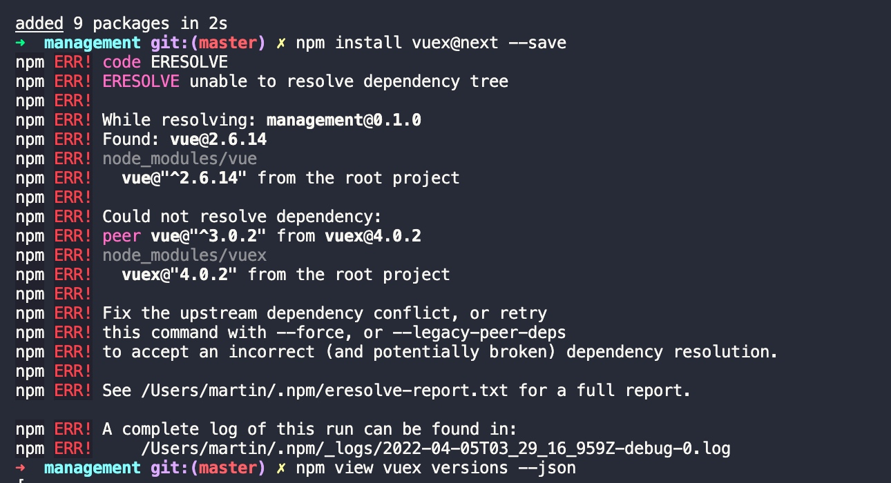

# vuex

[vuex官网](https://vuex.vuejs.org/zh/index.html)

当我们的应用遇到多个组件共享状态时，[单向数据流](https://vuex.vuejs.org/zh/index.html#%25E4%25BB%2580%25E4%25B9%2588%25E6%2598%25AF%25E2%2580%259C%25E7%258A%25B6%25E6%2580%2581%25E7%25AE%25A1%25E7%2590%2586%25E6%25A8%25A1%25E5%25BC%258F%25E2%2580%259D%25EF%25BC%259F)的简洁性很容易被破坏：
problem 1. 多个视图依赖于同一状态。
problem 2. 来自不同视图的行为需要变更同一状态。

对于问题一，传参的方法对于多层嵌套的组件将会非常繁琐，并且对于兄弟组件间的状态传递无能为力。
对于问题二，我们经常会采用父子组件直接引用或者通过事件来变更和同步状态的多份拷贝。以上的这些模式非常脆弱，通常会导致无法维护的代码。

vuex的背后思想:
因此，我们为什么不把组件的共享状态抽取出来，以一个`全局单例模式管理`呢？通过定义和隔离状态管理中的各种概念并通过强制规则维持视图和状态间的独立性，我们的代码将会变得更结构化且易维护.

vuex的机制:

[官方提供的vuex的学习视频](https://scrimba.com/learn/vuex)

## 简单使用

## mapState

[看这篇可以理解mapState](https://blog.csdn.net/chenjie9230/article/details/108883055)

## 错误

### Vuex安装时报错“Could not resolve dependency: npm ERR peer vue@“^3.0.2“ from vuex@4.0.2”

原因:
报错的原因：安装的版本过高的原因造成的

解决方法：
1、可以npm view vuex versions --json查版本，找适合的版本（不要最新的）

2、npm install vuex@3.6.2 --save根据版本下载，这样就可以了！

