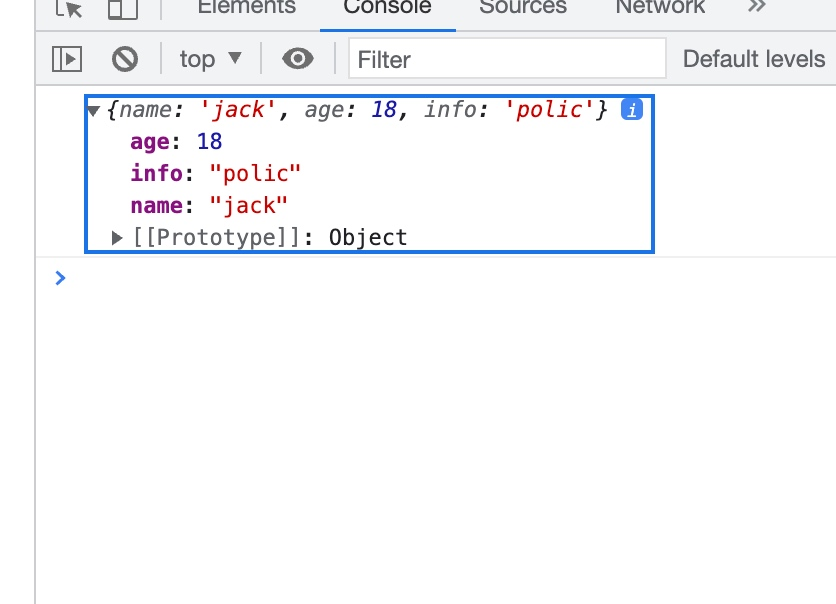

# ES6

## 箭头函数
 什么时候使用?
 > 一般在这样的场景中使用: 一个函数作为另一个函数的参数时候使用
 
 
### 基本使用
```
(参数列表) => {
    函数体
}
```

```js
const sum = (num1,num2)=>{
    return num1 + num2;
}
```

一个参数的时候可以将括号省略掉
```js
const power = num => {
    return num * num;
}

```

可以简写:
函数体只有一行代码
```js
// 会自动返回结果,如果没有返回结果会undefined
const mul = (num1,num2) => num1 * num2
```

### 箭头函数的this

指向最近作用域的对象


### 展开运算符


```html
<!DOCTYPE html>
<html lang="en">

<head>
    <meta charset="UTF-8">
    <meta http-equiv="X-UA-Compatible" content="IE=edge">
    <meta name="viewport" content="width=device-width, initial-scale=1.0">
    <title>Document</title>
</head>

<body>
    <script>
        var person = {
            name: 'jack',
            age: 18
        }
        var b = {
            ...person,
            info: 'polic'
        }
        console.log(b);
    </script>
</body>

</html>

```




