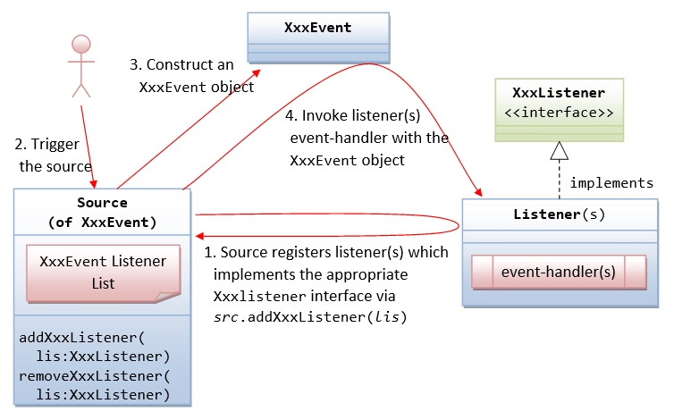

# Java

## JAVA SE

## GUI

[tutorial](https://www3.ntu.edu.sg/home/ehchua/programming/java/j4a_gui.html)

[黑马视频教程](https://www.bilibili.com/video/BV1wh411d7it?p=97)

### 最常用的两个包
1. java.awt 
    1. GUI Component classes, such as Button, TextField, and Label.
    2. GUI Container classes, such as Frame and Panel.
    3. Layout managers, such as FlowLayout, BorderLayout and GridLayout.
    4. Custom graphics classes, such as Graphics, Color and Font.

1. java.awt.event 
    1. Event classes, such as ActionEvent, MouseEvent, KeyEvent and WindowEvent,
    2. Event Listener Interfaces, such as ActionListener, MouseListener, MouseMotionListener, KeyListener and WindowListener,
    3. Event Listener Adapter classes, such as MouseAdapter, KeyAdapter, and WindowAdapter.

### 容器
组件必须放在容器里面

#### 最顶层的容器:
1. Frame 
2. Dialog 
3. Applet

> 其中applet已经不被大多数浏览器支持了

#### 第二层的容器有:
1. Panel
2. ScrollPane

### 组件

### 事件

