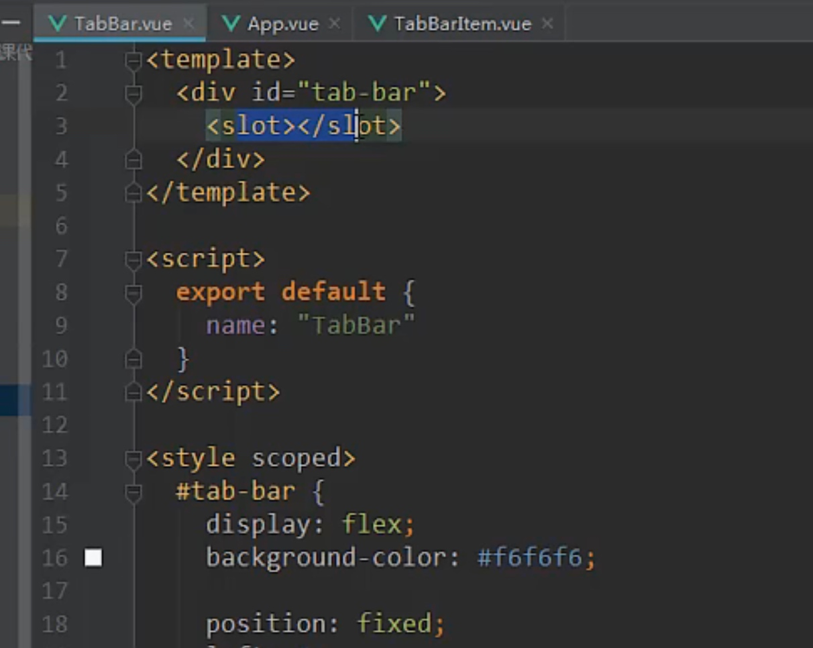

# 临时

实现的最终效果:

先是在App.vue中写上普通的div
一个是tab-bar
一个是tab-bar-item

问题是:
很难复用,因为下个项目要用的时候,需要将div整个拷贝过去,其次还要把相应的样式拷贝过去

解决方法:将tab-bar进行抽离和封装成组件
他这里将tabbar弄成一个文件夹,也是方便下次使用的时候直接将该文件夹复制过去即可

每个tab-bar-item中是需要一个img和一个文字的,所以还需要将图片资源复制到项目中,然后引用这些图片
这样带来的问题就是tab-bar和tab-bar-item的html混在一起,tab-bar的样式和tab-bar-item的样式也是混在一起.这不符合单个组件单个功能和单个样式的开发思想

所以将tab-bar-item抽出来,然后使用slot插槽占位,表示tab-bar里面可以插入一些东西

app.vue中只需要使用这样的就可以了

但是tab-bar-item中不能将img和文字写死,不然使用<tab-bar-item></tab-bar-item> 就会出现一样的东西,就会变成下面这样👇🏻

要想不写死,就使用插槽,这里使用了命名插槽.

然后就变成了这样子,这样就会将img和div文字替换掉slot,达到封装的目的.注意,他使用了命名插槽来替换.即slot属性

