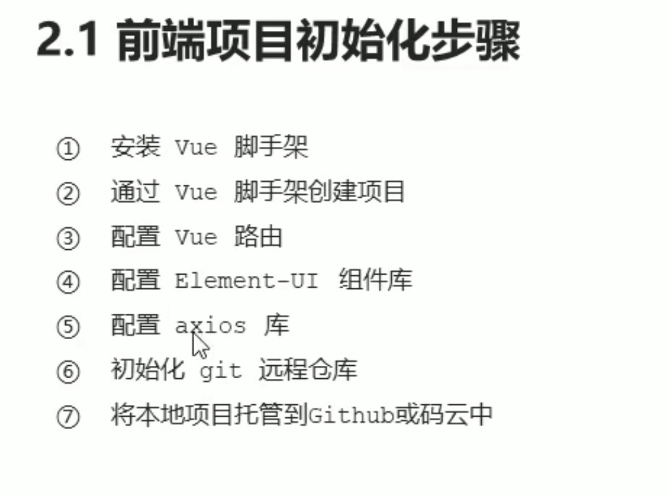
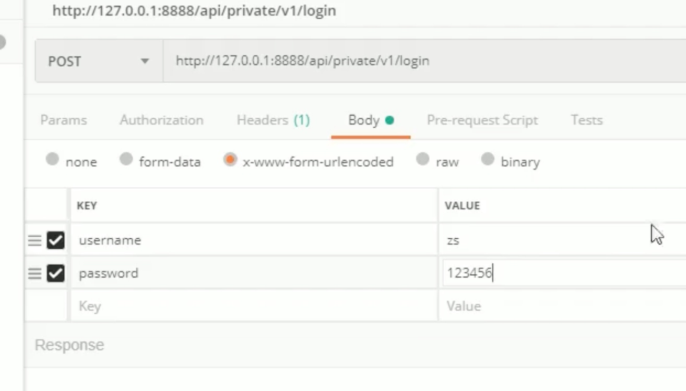
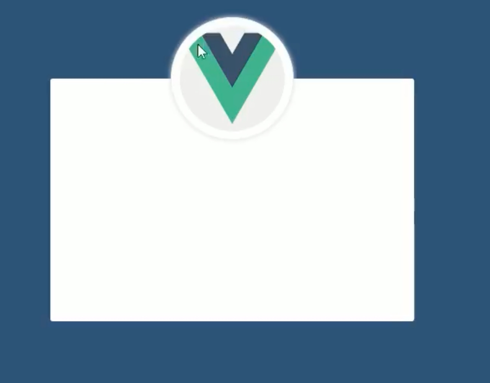
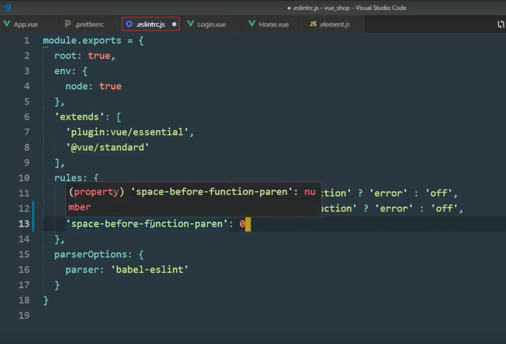

# 项目


## 项目中使用第三方的图标
[使用阿里的图标库](https://www.jianshu.com/p/f5de6e774fe7)

使用[视频讲解](https://www.bilibili.com/video/BV15P4y1t7k9?p=17&spm_id_from=pageDriver)


[vscode 使用element-ui的代码提示](https://blog.csdn.net/HPFBoy/article/details/107837979)


## 错误

### multi-word
Vue项目报错： Component name “xxx“ should always be multi-word vue/multi-word-component-names

原因: ESLint要求组件的名称
解决:
vue.config.js 文件中加一行
```js
lintOnSave: false
```


## 前端vue电商后台管理项目

[b站链接](https://www.bilibili.com/video/BV15P4y1t7k9?p=3&spm_id_from=pageDriver)


项目准备:



采用ui的界面方式创建项目


需要安装的(勾选的)
Babel
Router
Linter/Formatter
使用配置文件


由于选择了Formmatter


安装插件


安装axios:


postman api接口测试:




> 如果不存在跨域问题,则使用cookie和session
> 如果存在,那么使用token


### 跨域问题
什么是跨域?
跨域问题是由浏览器的同源策略引起的，在后端编程语言的Http Client调用中不会存在。同源策略中的同源是说站点的协议、域名、端口都需要相同。跨域便是请求不同源的站点的一种行为操作。
> 简单来说,就是我是我,你是你,我不给你访问!

怎么解决?
1. CORS (Cross-origin resource sharing，跨域资源共享)
2. 使用代理 如Nignx


## 开发登录功能

首先检查工作区是否干净:就是没有可提交的文件


然后由于是新功能,所以创建一个git分支进行开发,开发完成之后进行合并到master分支上
创建分支并切换到新创建的分支:


查看分支:


样式选择less且为scoped 表示只对当前的组件生效


为了支持less,还需要安装开发依赖:


less-loader是依赖less的,所以还需要安装less


盒子居中:
1. 首先将html body 和 app 高度都撑满
2. 然后使用绝对定位和transform就可以居中 神奇!!! [原理解释](https://segmentfault.com/a/1190000002436755) 
> 原理是: 使用绝对定位,使得盒子移动到50%和50%,但是此时的位置是这样的:盒子的左上角是在页面的正中间,所以要想办法将盒子的中心移到盒子的左上角的位置,所以使用transform来做位移.


头像的样式:
1. 在登录盒子的里面,这里使用less语法,这种就很方便,里面的盒子依据父盒子进行定位
2. 还是使用绝对定位和transform进行位置的移动





up主解释了这个label的作用
form上的label-width是设置label的宽度,为了label的占位(可以这么理解)
item上的label是输入框前面的文字说明


### 表单验证规则


1. 绑定属性rules
2. 为某个input添加prop属性表示对该input进行那种规则的验证


rules是一个对象,每个规则是一个数组,也就是说可以定义多个规则.比如规则名为name.


### 重置表单

先为表单添加一个ref属性


然后通过this.$refs去访问这个表单引用对象(可以理解为就是这个表单对象),然后调用resetFields()函数,这个是element-ui官网提供的方法


在登录之前,应该先进行表单验证.可以通过element-ui的validate函数进行验证.

validate的参数是一个回调函数,该回调函数的第一个参数是一个布尔值,表示验证的结果的正确性.


## axios的配置

1. 导入axios
```js
import axios from 'axios'
```
2. 添加到原型链
```js
Vue.prototype.$http = axios
```
3. 配置请求的根路径
```js
axios.defaults.baseURL = '后端的API的基地址'
```


### 登录请求

第一次老师是这样写的,但是根据浏览器对象返回的是一个promise对象.所以说明在这个函数(这里指的是this.$http.post)前加上关键字`await`,而await只能用在被async修饰的方法中,所以将await修饰的函数的邻近函数加上async关键字.


即结果是这样的:


于是,返回的数据就不是一个promise对象了.


但是,只有data对象是需要的,其他的都是axios添加的东西.
于是进行对象的解构(老师用的词).
```js
const {data : res} = await this.$http.post("login",this.loginForm);
```
其中`this.$http`就是axios对象,发起post请求,由于配置了基地址,所以只需要写上`login`即可.请求参数是表单对象.
由于加了await对象返回的是axios返回的对象,但是我们只需要后端返回的data(data是后端真实返回的),所以采用`{data:res}`这种写法.表示我需要把data拿出来,然后赋值给res.


我们可以看到这个data对象中的meta是具体返回的信息:


通过状态码来判断是否登录成功:


### 弹窗提示

导入组件,但是要求全局使用,即必须挂载到原型链上.
```js
Vue.prototype.$message = Message;
```
这里的$message是随便取的名字.


使用:


### token的处理

token不保存到localStorage中,因为localStorage是持久保存的.token只用于会话中,所以保存到sessionStorage中.
```js
window.sessionStorage.setItem(key,value);
```


登录成功之后,就可以在浏览器中的Application中看到Session Storage中看到.


问题:
将token删除后,依然能够通过/home来访问到主页.即不需要登录就可以看到主页.


解决:


需要重新写下router.js中的内容:
因为要挂载一个导航守卫.


具体的写法:


### 登录退出


### 关于项目代码格式化





[github上vscode的配置](https://github.com/qianguyihao/Web/tree/master/00-%25E5%2589%258D%25E7%25AB%25AF%25E5%25B7%25A5%25E5%2585%25B7)


### 合并登录功能
老师是先将登录功能全部提交之后,在进行合并
合并要先切换到master分支,再进行合并


推送到远端仓库:


将login分支推送到远端仓库:


### 主页布局

#### 头部区域布局


代码解释:
1. 首先每个element-ui的标签名就是一个类名,所以可以用`.el-header`作为类选择器
2. 然后布局为flex布局
3. 由于el-header存在padding,不想要这个左边的padding,这样图片可以顶着左边,所以将padding-left的值设置为0
4. 其次因为按钮是贴着上下边,所以要将按钮设置为居中的形式,设置align-items的值为center (看到弹幕说align-item的默认值是strech,所以会沾上下边)
    

5. 内容分布为`justify-content`为space-between 分散两边
6. 图片和文字包在一个div中,布局也为flex,这是为了调整图片和文字的布局
7. 首先将图片和文字都居中对齐,采用了`align-item`为center

这里不明白这个 `>div`是什么意思,表示子元素? 那span不也是div的子元素么,为啥不加`>`??

> 可能是因为嵌套了flex布局,所以才使用>符号


#### 菜单布局


### 请求拦截
可以理解成请求预处理


1. element-ui提供的el-submenu中的index属性必须给定是字符串,所以动态绑定的时候把item.id改成了字符串