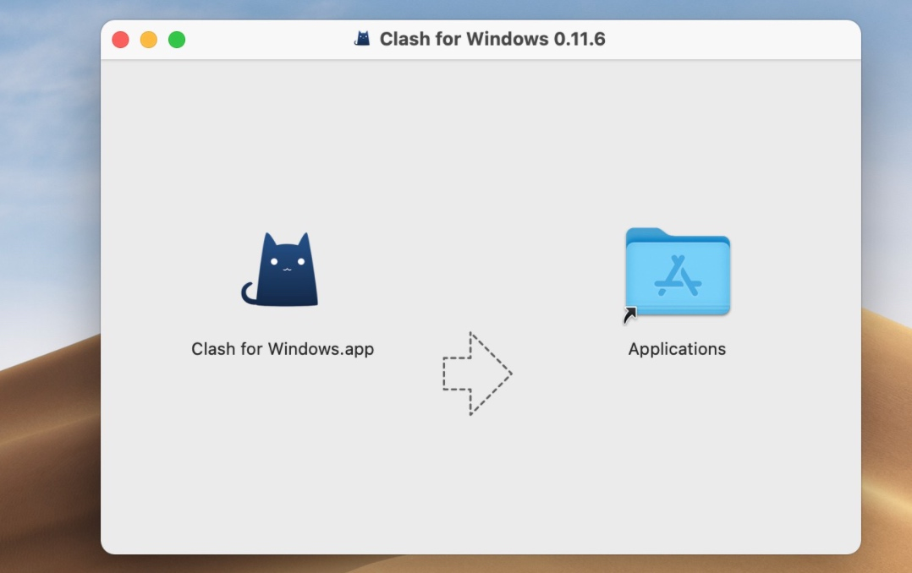
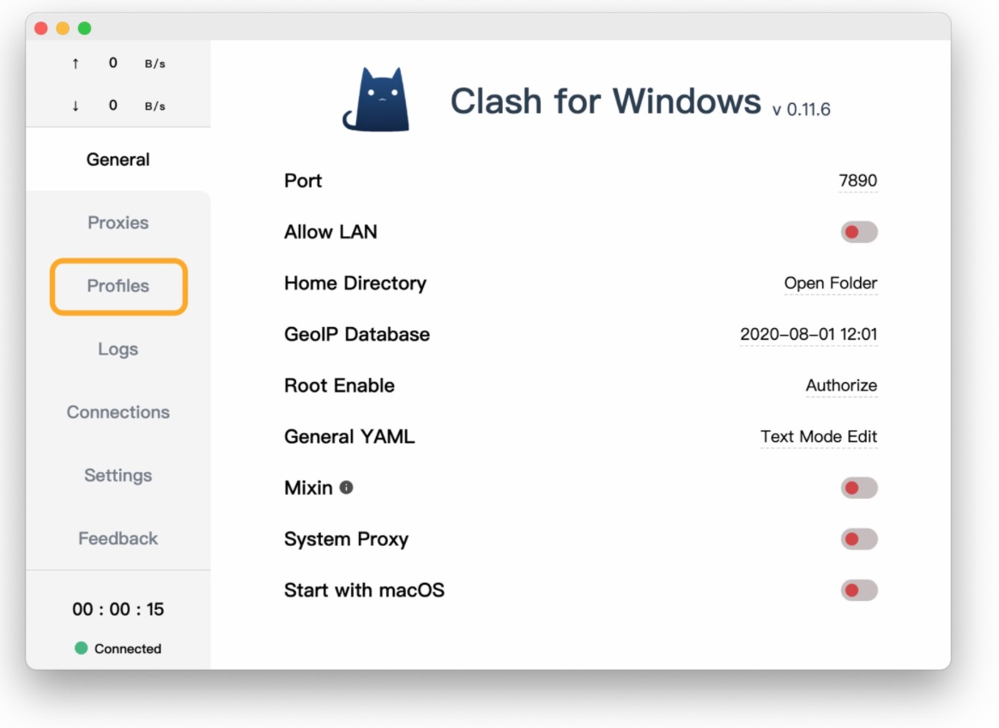
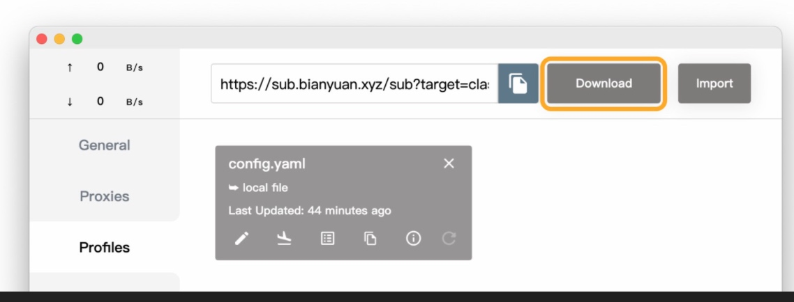
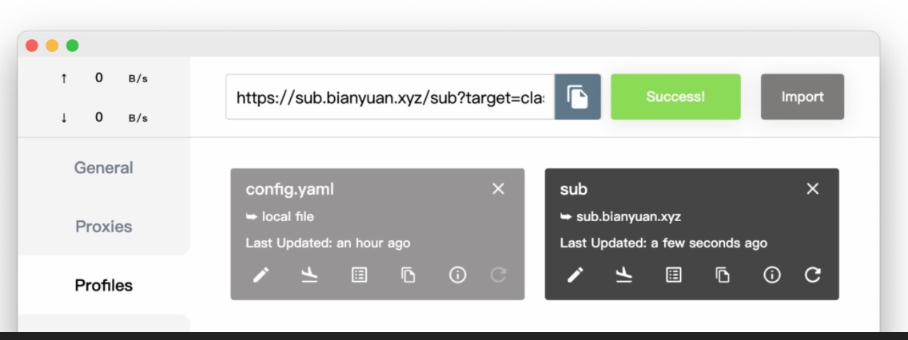
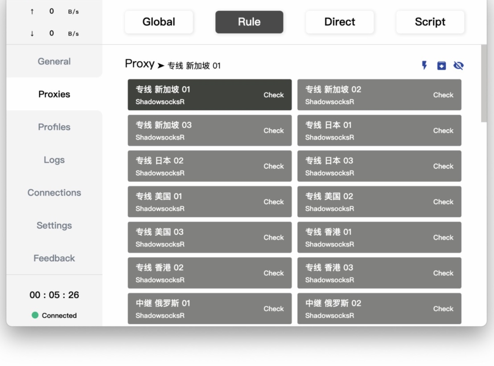
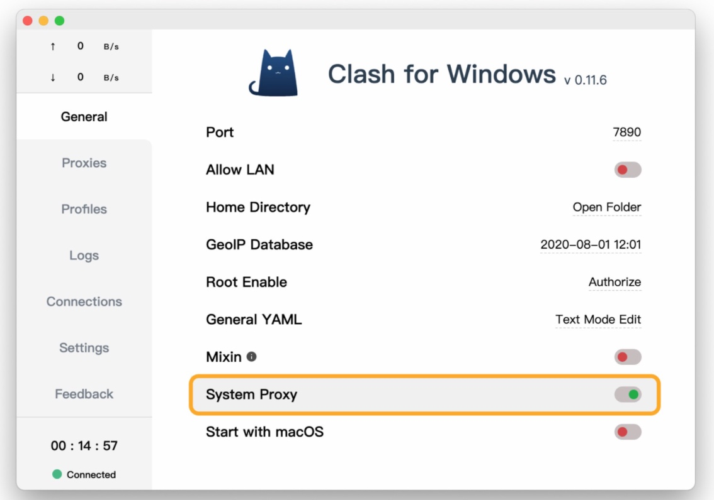

# Clash for Windows for Mac教程


[作者链接](https://merlinblog.xyz/category/wiki/)
2. 整理教程时的系统环境
macOS Big Sur
Clash for Windows for Mac v0.11.6


3. 下载与安装
Github项目地址：https://github.com/Fndroid/clash_for_windows_pkg/releases

从releases界面下载.dmg格式的文件进行安装。





如果macOS阻止运行该软件，请执行以下操作：

由于 macOS 默认情况下只允许运行可信任签名的应用，如果 macOS 阻止运行该软件，请打开 macOS 终端，在新建的终端 Shell 中输入：
```shell
sudo spctl --master-disable
```


1. 添加订阅

打开 Clash for Windows for Mac 后，点击窗口左侧的 Profiles (配置文件)。



在 Profiles 页面顶部，输入 Clash 配置订阅链接，然后点击 Download 下载配置文件。



下载成功后，Clash for Windows 将自动切换配置文件。




1. 设置代理模式

点击窗口左侧的 Proxies (代理)。

默认情况下，Clash 使用 Rule (规则) 模式。不推荐选择 Global (全局) 与 Direct (直连) 模式。



Clash 支持通过策略组，对不同的网站使用不同的策略。合理使用分流可以提升使用体验。

选择完成后，点击窗口左侧的 General (通用)。
开启 System Proxy (系统代理)，即可科学上网。


